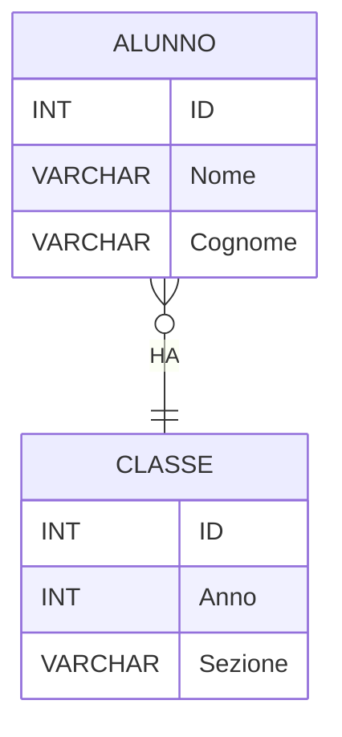

# I Database
## Le basi
I database nascono come alternativa ai precedenti **record**, a causa della poca flessibilità, dei priblemi di **accesso concorrente** e quindi di coerenza dei dati. 

Ogni database ha un sistema di gestione automatico, detto **DBMS** e tutte le operazioni, dette **transazioni** che permermettono di ottenere una **vista**. 

Ogni transazione deve:
- essere **atomica** ovvero non visibile dall'esterno e non può essere interrotta
- essere **consistente** ovvero dice che un database deve essere coerente
- essere **isolation** ovvero non si può vedere cosa succede durante una transazione
- essere **durabie** ovvero il suo effetto deve essere permanente
Tutto si racchiude nell'acronimo **ACID**.

Esiste anche un sistema di **rollback**, che permette far di tornare il database al momento prima della transazione.

---

## Lo schema ER (entità e relazione)
Esemprio di database con uno schema ER, con anche le relazioni

> leggenda delle cardinalità :
> - |o è (0,1)
> - || è (1,1)
> - }o è (0,N)
> - }| è (1,N) 

---

## Lo schema logico
Esempio del database soprastante con uno schema logico 
`Studente: ID, Nome, Cognome, IDClasse;`  
by ***Leonardo Canu*** *5B-IA*
